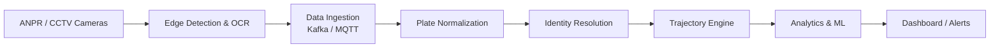

# Trajexa

**City-Wide AI Engine for Multi-Camera ANPR Trajectory Tracking and Urban Traffic Analytics**

Built by **Team Nova Minds** for **Smart India Hackathon 2026**.

| | |
|---|---|
| **Problem Statement ID** | SIH26127 |
| **Problem Statement** | City-Wide AI Engine for Multi-Camera ANPR Trajectory Tracking and Urban Traffic Analytics |
| **Theme** | Transportation & Logistics |
| **Category** | Software |
| **Live Demo** | [trajexaa.netlify.app](https://trajexaa.netlify.app/) |

---

## The Problem

City ANPR (Automatic Number Plate Recognition) cameras usually work as disconnected islands. Each camera reads plates, but nothing connects a vehicle's sightings across cameras into one journey. Because of this, police cannot quickly reconstruct a suspect vehicle's route, traffic authorities lack reliable travel-time and congestion data, and urban planners have no trustworthy origin-destination information.

## Our Solution

Trajexa turns existing ANPR and CCTV cameras into one connected intelligence layer. It reads number plates, matches the same vehicle across cameras, builds its complete movement trajectory, analyzes traffic flow and congestion, predicts traffic conditions from historical data, and presents everything on a live dashboard with automated alerts.

**Key capabilities**

- **Multi-camera monitoring:** one map view of every ANPR camera node, with its status (Normal, High Density or Alert Event) and plate-read count.
- **Live ANPR ingestion stream:** a running feed of plate reads with camera, vehicle type and OCR confidence.
- **Vehicle trajectory reconstruction:** search any plate to see its full route on a map, with a chronological sighting chain showing time, direction, speed and confidence at each camera.
- **Traffic analytics:** corridor average speeds, a congestion index by corridor, a city-scale origin-destination flow matrix, and a short-term traffic forecast.
- **Wanted-vehicle intercepts:** a watchlist registry that raises live alerts the moment a flagged plate is sighted.
- **AI investigator brief:** one click turns a trajectory into a short plain-text brief for a control-room operator, generated with Google Gemini.

---

## What This Repository Contains

This repository is the **working dashboard prototype** of Trajexa. It demonstrates the user experience and the data flow end to end, so that judges and stakeholders can see how the system behaves.

**Please note:** the camera network, plate reads and trajectories in this demo come from bundled **sample data for Delhi** (12 cameras, 3 preset vehicle trajectories and 5 watchlist entries). The live feed is simulated in the browser. The computer-vision pipeline described below is the **proposed production architecture** and is not run inside this repository.

| Component | Status in this repo |
|---|---|
| Dashboard (map, trajectory view, analytics, alerts, watchlist) | Built and deployed |
| REST API (cameras, trajectories, watchlist, config) | Built and deployed |
| AI investigator brief (Gemini) | Built and deployed |
| Persistent watchlist (Netlify Blobs) | Built and deployed |
| Live camera feed and plate reads | Simulated sample data |
| YOLO detection, OCR, tracking, forecasting models | Proposed architecture (see below) |

---

## Proposed Production Architecture



**Processing flow for each video frame**

1. Capture the frame from the camera stream.
2. Detect vehicles with YOLO and assign a persistent track ID with ByteTrack.
3. Crop the plate region and read it with PaddleOCR. Failed reads are flagged for manual review.
4. Normalize the plate text, for example by fixing common OCR confusions such as 8 and B or 0 and O.
5. Convert pixel positions to real-world coordinates with a homography transform.
6. Append the point to the vehicle's trajectory and write it to a spatial database (PostgreSQL with PostGIS).
7. Aggregate flow counts over time and compute speed, density and time-of-day features.
8. Forecast traffic with an LSTM or ST-GCN model. If congestion crosses a threshold, trigger an alert and suggest a signal-timing adjustment.
9. Update the dashboard with live and predicted state.

**Planned technology stack**

| Layer | Technologies |
|---|---|
| Detection and OCR | YOLOv8 / YOLOv11, PaddleOCR, OpenCV |
| Backend | Python, FastAPI |
| Streaming | Kafka / MQTT |
| Storage | PostgreSQL + PostGIS, NetworkX / Neo4j |
| Analytics and ML | Pandas, Scikit-learn, PyTorch |
| Frontend | React.js, Leaflet / Mapbox |

**Why it is feasible**

- It uses existing ANPR and CCTV infrastructure, so no new cameras are mandatory.
- It relies on open-source AI and OCR technologies.
- The modular design supports phased rollout. It can begin with one corridor and scale city-wide.
- It can run in the cloud or on-premise.

---

## Impact

| Stakeholder | Benefit |
|---|---|
| Traffic Police | Faster tracking of stolen or wanted vehicles |
| Traffic Authorities | Real-time congestion and travel-time intelligence |
| Investigators | Quick reconstruction of a vehicle's route |
| Urban Planners | Reliable origin-destination data |
| Citizens | Reduced congestion and travel time |
| Environment | Reduced fuel wastage and emissions |

---

## Tech Stack of This Prototype

- **Frontend:** HTML, Tailwind CSS, [Leaflet](https://leafletjs.com/) maps, [Chart.js](https://www.chartjs.org/) charts
- **Backend:** Node.js and Express, wrapped as a single serverless function with `serverless-http`
- **Storage:** [Netlify Blobs](https://docs.netlify.com/blobs/overview/) for the watchlist
- **AI:** Google Gemini API for investigator briefs
- **Maps:** MapTiler tiles, with automatic fallback to OpenStreetMap
- **Hosting:** Netlify

## Project Structure

```
Trajexa/
├── netlify.toml                 Build settings and the /api/* redirect to the function
├── package.json
├── .env.example                 Names of the environment variables to set
├── public/
│   └── index.html               Static frontend (Leaflet, Tailwind, Chart.js)
├── netlify/functions/
│   └── api.js                   Express API wrapped as one Netlify Function
└── data/
    ├── cameras.json             Sample camera network (Delhi)
    ├── trajectories.json        Preset vehicle trajectories
    └── watchlist.json           Initial watchlist seed
```

## API Reference

All routes are served under `/api`.

| Method | Endpoint | Description |
|---|---|---|
| GET | `/api/health` | Health check, returns `{"ok":true}` |
| GET | `/api/config` | Map settings and whether AI is enabled |
| GET | `/api/cameras` | All camera nodes |
| GET | `/api/trajectories` | All preset trajectories |
| GET | `/api/trajectory/:plate` | Trajectory for one plate (a sample route is generated for unknown plates) |
| GET | `/api/watchlist` | List watchlist entries |
| POST | `/api/watchlist` | Add a plate to the watchlist |
| DELETE | `/api/watchlist/:plate` | Remove a plate from the watchlist |
| POST | `/api/ai/brief` | Generate an investigator brief for a trajectory (limited to 10 requests per minute) |

## Environment Variables

Copy `.env.example` to `.env` for local use, and set the same names in Netlify under **Site settings → Environment variables**.

| Variable | Purpose |
|---|---|
| `GEMINI_API_KEY` | Enables the AI investigator brief. It stays on the server. |
| `GEMINI_MODEL` | Optional model name. Defaults to `gemini-2.5-flash`. |
| `MAPTILER_API_KEY` | Optional map tiles. Without it, OpenStreetMap tiles are used. |
| `MAPTILER_STYLE` | Map style. Defaults to `streets-v2-dark`. |
| `MAP_CENTER_LAT`, `MAP_CENTER_LNG`, `MAP_ZOOM` | Initial map view. Defaults to Delhi. |

## Run Locally

You need Node.js 18 or newer.

```bash
git clone https://github.com/Samdcruzzz/Trajexa.git
cd Trajexa
npm install
cp .env.example .env      # then add your own keys
npm run dev               # starts Netlify Dev, serving the site and the function together
```

## Deploy to Netlify

1. Push this repository to GitHub.
2. In Netlify, choose **Add new site → Import from Git** and select the repository. Settings are read from `netlify.toml`, so leave the build command empty.
3. Add the environment variables listed above.
4. Deploy, then open `https://<your-site>.netlify.app/api/health`. It should return `{"ok":true}`.

## Security Notes

- **Never commit `.env` or real API keys.** If a key is ever shared in a file or chat, delete it and create a new one.
- `MAPTILER_API_KEY` is sent to the browser by design, so restrict it to your Netlify domain in the MapTiler dashboard.
- The watchlist has no login, so anyone with the URL can add or remove entries. Add authentication, for example Netlify Identity, before using it outside a demo.
- The AI rate limit is applied per warm function instance, so treat it as a soft limit.

---

## Team Spotlight

| Role | Member | GitHub |
|---|---|---|
| Team Leader | ThanuShree99 | [@ThanuShree99](https://github.com/ThanuShree99) |
| Team Member | Samdcruzzz | [@Samdcruzzz](https://github.com/Samdcruzzz) |
| Team Member | sudhamanikandan206 | [@sudhamanikandan206](https://github.com/sudhamanikandan206) |
| Team Member | archanas126002-bit | [@archanas126002-bit](https://github.com/archanas126002-bit) |
| Team Member | Aishukv13-nebula | [@Aishukv13-nebula](https://github.com/Aishukv13-nebula) |
| Team Member | advikamannan | [@advikamannan](https://github.com/advikamannan) |

## References

- Multi-target Multi-camera Vehicle Tracking for City-Scale Traffic Management
- Traffic-Aware Multi-Camera Tracking of Vehicles Based on ReID and Camera Link Model (arXiv)
- City-Scale Multi-Camera Tracking of Vehicles using YOLOv9 and ByteTrack (IEEE Xplore)
- Online Multi-Camera Multi-Vehicle Tracking using YOLO11 (Springer)
- Ultralytics YOLO: Multi-Object Tracking Documentation
- Real-Time Automatic License Plate Recognition using YOLOv8 and SORT (arXiv)

---

*Built for Smart India Hackathon 2026 by Team SPOTLIGHT.*
